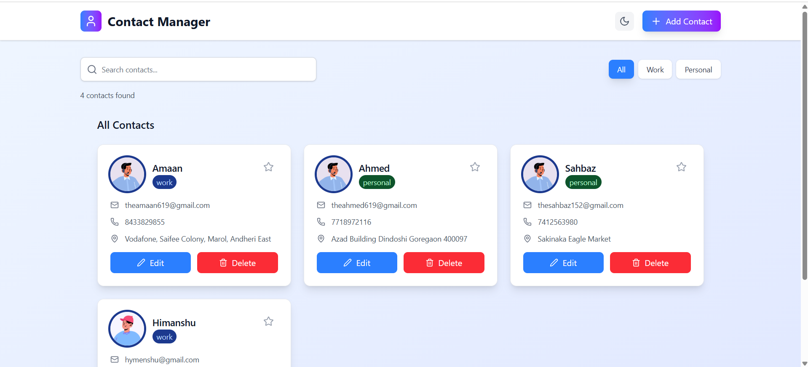
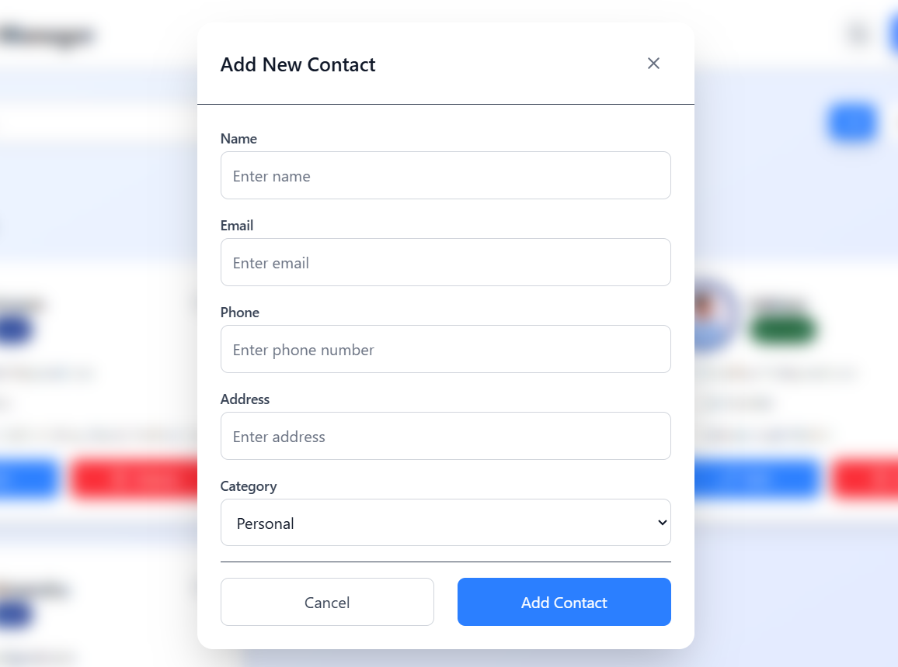
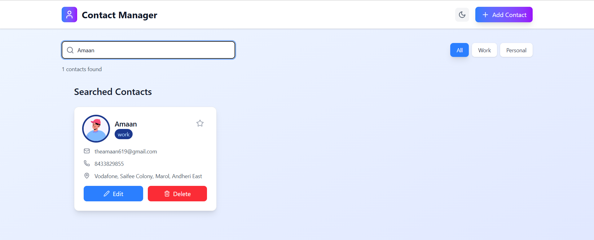
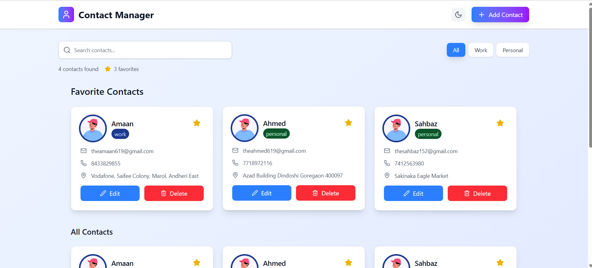

# 📇 Contact Manager

A sleek and responsive **Contact Manager** built using **React** and **Tailwind CSS**, offering full **CRUD operations**, theme switching (light/dark), contact categorization, and favorites — all persisted using **local storage**.

---

## 🌟 Features

- 🌞 **Light/Dark Theme Toggle**
- 📝 **Add, Edit, Delete Contacts**
- ⭐ **Mark Contacts as Favorite**
- 🔍 **Real-time Search Filtering**
- 🗂️ **Category Tags**: Personal or Work
- 💾 **Local Storage Persistence**
- 📱 **Responsive Design for All Devices**

---

## 📸 Preview

### 🖥️ Main Dashboard

Shows all contacts with category and favorite options.  

---

### ➕ Add New Contact

A form to add a new contact with name, phone, email, and more.  

---

### 🔍 Searched Contact

Search instantly filters through contacts by name, email, or phone.  

---

### ⭐ Favorite Contacts

Only contacts marked as favorite are shown in this section.  

---

### 🛠️ Edit Contact Details

Modify existing contact info with ease in a dynamic form.  

---

## 🛠️ Built With

- ⚛️ [React](https://reactjs.org/)
- 💨 [Tailwind CSS](https://tailwindcss.com/)
- 🗃️ Local Storage API

---

## 📂 Project Highlights

- Clean UI & mobile-first design
- Contact data is preserved across page reloads
- Elegant transitions and accessibility focus
- Easy to extend with filter, sort, or category-based views

---

## 🙌 Author

Made with 💙 by Amaan Sayyed

---
