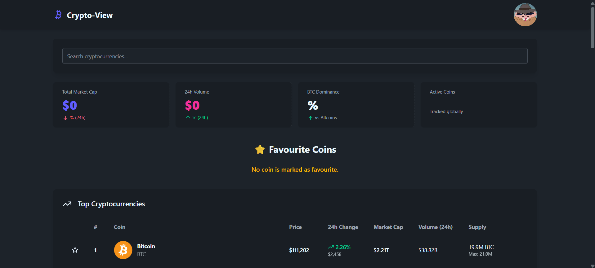
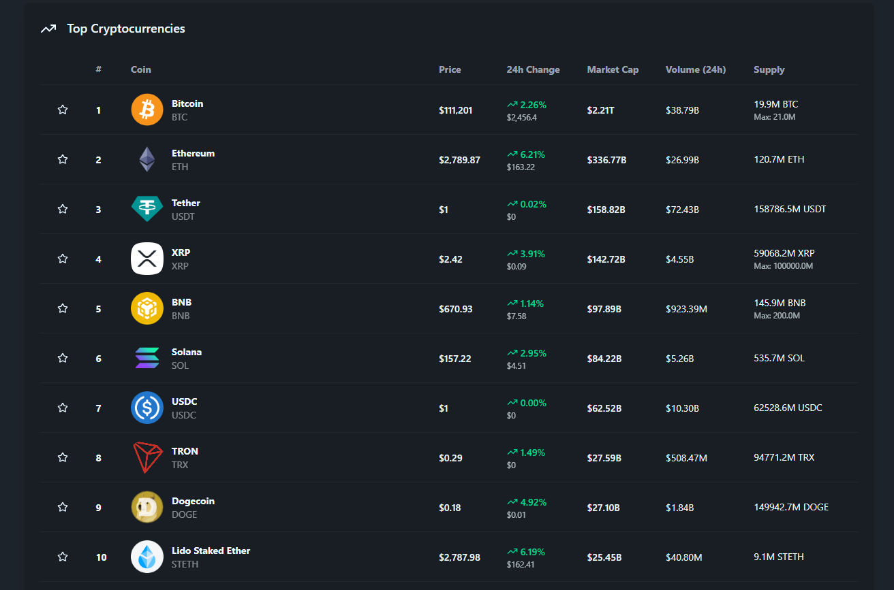
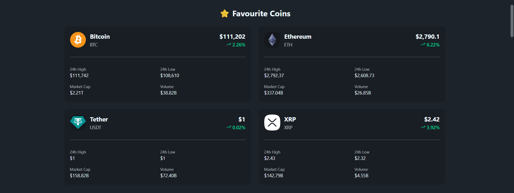

# 🚀 Crypto View

**Crypto View** is a clean and responsive React-based cryptocurrency tracker. It provides live market data powered by the [CoinGecko API v3](https://www.coingecko.com/en/api), featuring a real-time searchable list of top cryptocurrencies, favorite tracking, detailed insights, and a user-friendly dark/light UI.

Built using modern tools like **React**, **TailwindCSS**, **DaisyUI**, and **Axios**, it is designed with simplicity and performance in mind — whether you're just exploring crypto or actively tracking your portfolio.

---

## 🌟 Features

- 🔍 **Live Search & Filter** for all top 50 coins
- ⭐ **Mark & Track Favourites**
- 📈 **View Detailed Coin Stats** (price, 24h high/low, volume, market cap)
- 📊 **Market Overview Cards** using CoinGecko global data
- 💡 **Responsive UI with Light/Dark Mode**
- 💻 Built using **React + TailwindCSS + DaisyUI**
- 🔗 Data sourced from **CoinGecko API v3**

---

## 🖼️ Preview

### 🏠 Main Dashboard

### 📃 All Coins Table

### ⭐ Favourite Coins View

---

## 🔧 Tech Stack

- **React**
- **Tailwind CSS v4**
- **DaisyUI**
- **Axios**
- **CoinGecko API v3**

---
