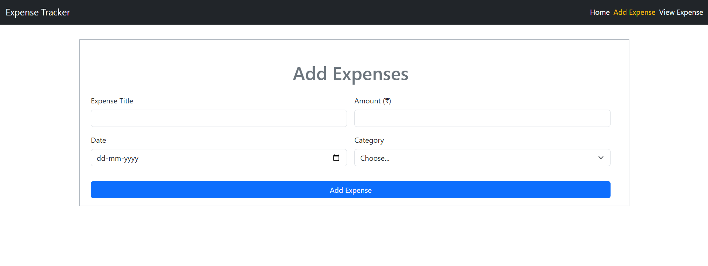
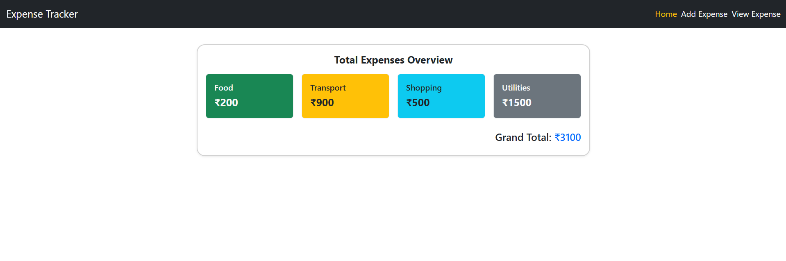
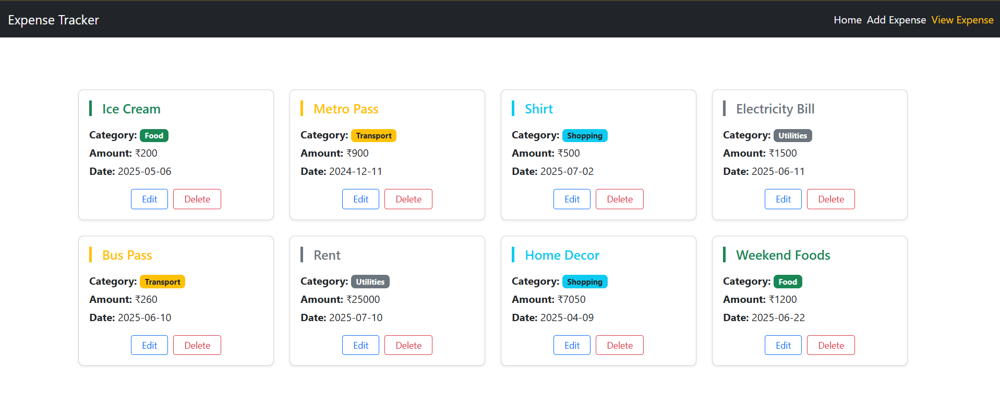
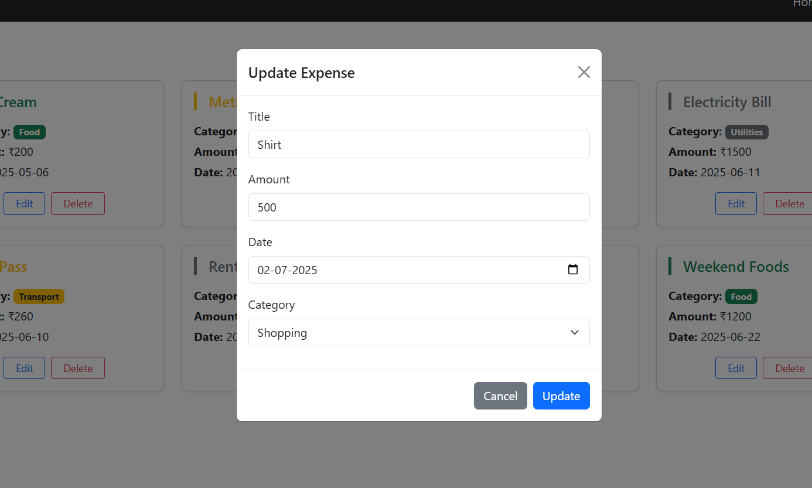

# 💸 Expense Tracker App

A simple React-based Expense Tracker application to manage and visualize personal expenses. Users can add, view, delete, and update expense entries with category-wise tracking and a summary dashboard.

## 🚀 Features

- ✅ Add new expenses with title, amount, date, and category
- ✅ View all saved expenses with styled category labels
- ✅ Delete expense entries from local storage
- ✅ Update any expense through a Bootstrap modal form
- ✅ Dashboard displaying:
  - Grand total of all expenses
  - Total expense per category (Food, Shopping, Transport, Utilities)
- ✅ Fully responsive Bootstrap layout
- ✅ Data stored in **localStorage** for persistence

---

## 🖼️ Screenshots

### 📥 Add Expense

### 📊 Dashboard (Home)

Displays category-wise totals and grand total.

### 📄 View Expenses

Displays list of all expenses with category colors and delete/edit buttons.

### 📝 Update Expense

Editable form in modal popup for modifying existing entries.

---

## 🛠️ Tech Stack

- **React**
- **React Router DOM**
- **Bootstrap 5**
- **LocalStorage** for data persistence
- **useState, useEffect, useMemo** React Hooks

---
