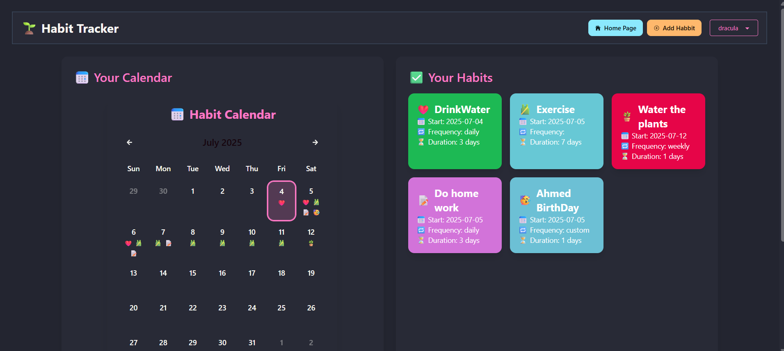
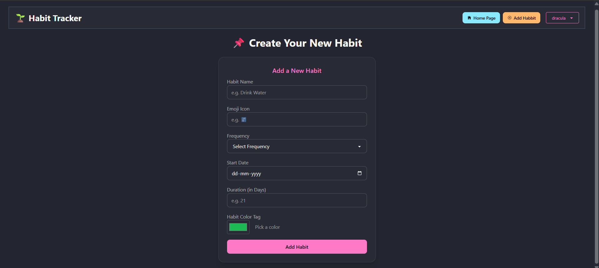
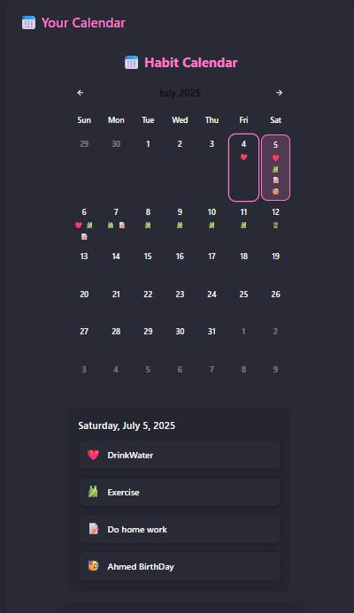

# 📅 Habit Tracker App

A modern, responsive **Habit Tracker** built with **React**, **Tailwind CSS**, and **DaisyUI v5**, featuring a custom-built calendar UI that visually displays your habits, their schedules, and progress. Users can easily add habits with a duration, and view them directly on the calendar grid.

---

## 🎯 Features

- ✅ Add habits with emojis, start date, and duration
- 📆 **Custom calendar** that shows scheduled habits on the corresponding days
- 🎨 **Theme switcher** using DaisyUI (light, dark, and more)
- 🔀 Page routing handled by **React Router DOM**
- 📱 Fully responsive with **Tailwind CSS** utility classes

---

## 🚀 Tech Stack

- **React** (v18+)
- **Tailwind CSS**
- **DaisyUI v5** (theme-enabled)
- **React Router DOM**
- Local Storage for habit persistence

---

## 🖼️ Screenshots

### 🏠 Main Dashboard

### ➕ Add Habit

### 📅 Scheduled Habits

---
