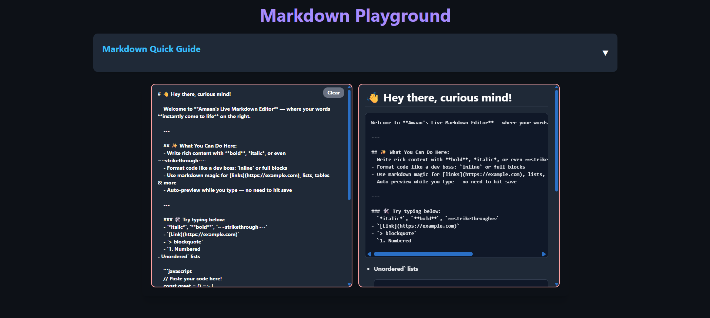
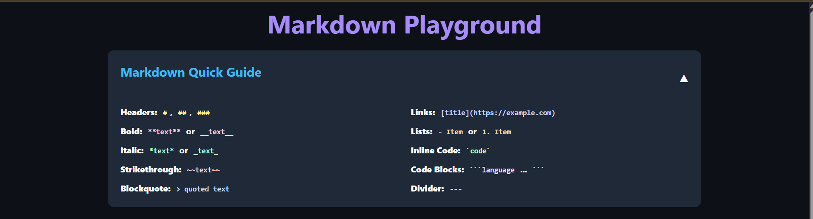

# 📝 Markdown Playground

Welcome to **Markdown Playground** — a sleek, responsive, and feature-rich markdown editor built using **React**, **Tailwind CSS v4**, and **react-markdown**. Write markdown on the left, preview it live on the right!

---

## 🚀 Features

- 🔄 **Live Preview** with real-time markdown rendering
- 🎨 **Split Layout** — Editor on the left, Preview on the right
- 📘 **Markdown Quick Guide** section for beginners
- 🌙 **Dark Theme UI** with vibrant color accents
- 💾 Auto-scroll, responsive height adjustments, and mobile-first design
- ❌ **Clear Button** to reset editor input instantly

---

## 🧩 Tech Stack

- ⚛️ **React**
- 🎨 **Tailwind CSS v4**
- 🧠 **react-markdown**
- 📝 **remark-gfm** and **rehype-raw** for extended markdown support (tables, strikethrough, HTML, etc.)

---

## 📸 Screenshots

### 💻 Main Interface

### 📚 Markdown Quick Guide

---
