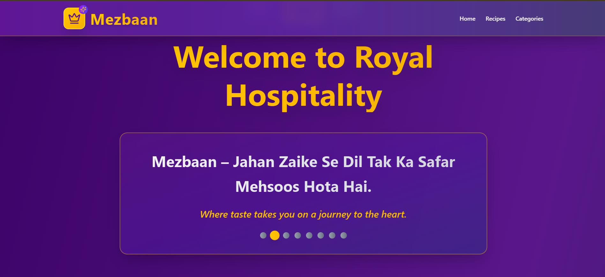
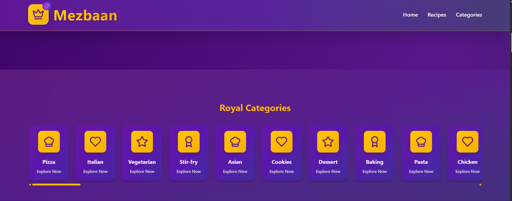
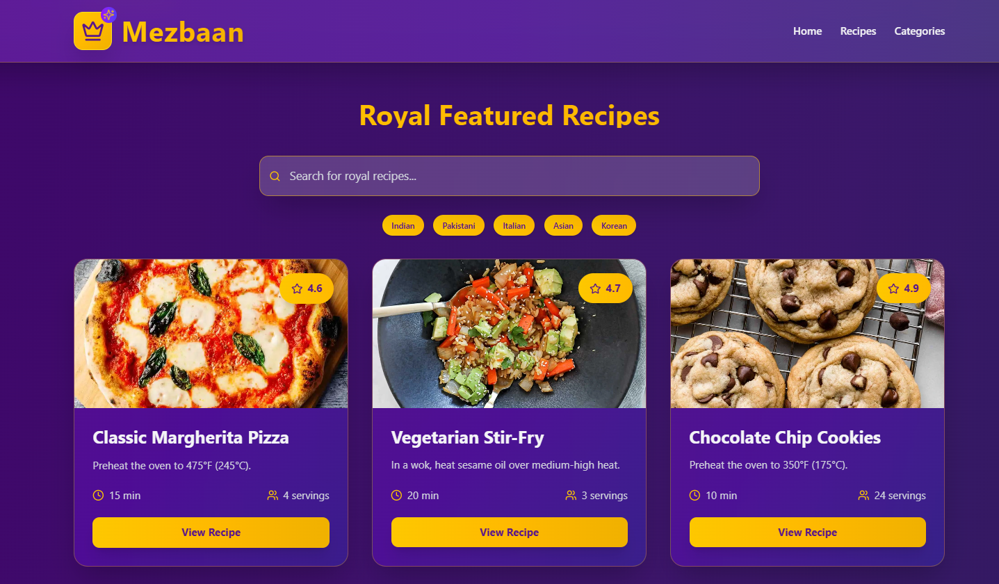
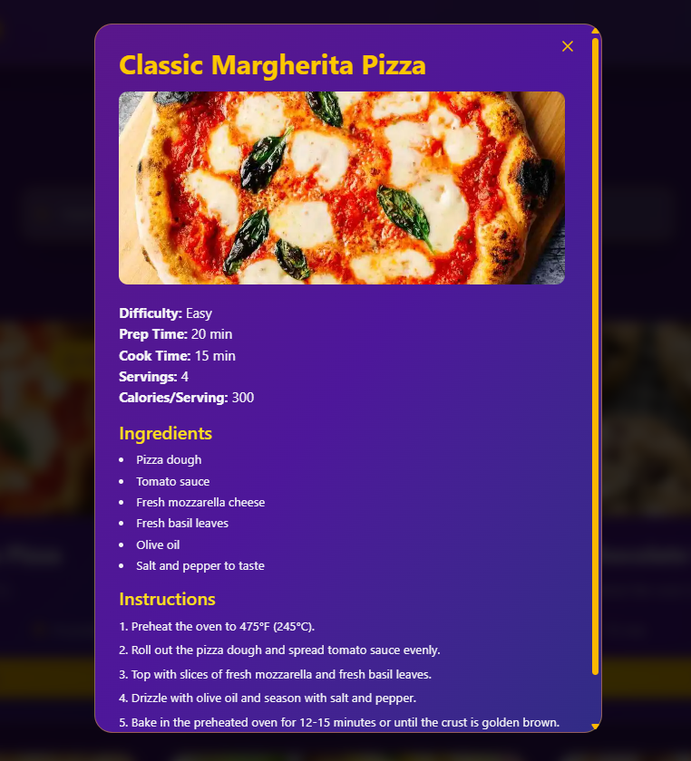

# 👑 Mezbaan – میزبان

> **"Mezbaan – Zayka, Mohabbat, Aur Mehmaan Nawazi Ek Saath."**  
> _Flavor, love, and hospitality — all together._

---

Welcome to **Mezbaan**, a royal and delightful recipe showcase where every flavor is a guest and every recipe is a celebration. Built with elegance, simplicity, and passion for cuisine, Mezbaan brings you carefully crafted interfaces and delicious data — all served with a warm digital smile. 🍽️✨

---

## 🌟 Features

- 🟡 **Royal Hero Section** with animated lines and poetic touch
- 🟡 **Dynamic Category Scroller** to explore cuisines like Indian, Italian, Pakistani, and more
- 🟡 **Powerful Search Bar** to filter recipes instantly
- 🟡 **Detailed Recipe Modal** with:
  - 🕰️ Cooking Time
  - 🧑‍🤝‍🧑 Servings
  - 🥄 Ingredients
  - 📖 Instructions
- 🟡 **Sticky Header**, fully responsive design, and theme-optimized UI
- 🟡 **Featured Section** that updates based on selected category or tag
- 🟡 **Clear filter & reset logic** for user-friendly interaction

---

## 🧠 Tech Stack

- ⚙️ **React.js** – UI development
- 🎨 **TailwindCSS + DaisyUI** – Styling
- 🔌 **Axios** – API handling
- 📦 **DummyJSON Recipe API** – All recipes and tag-based filtering

---

## 🧩 API Integration

This app uses the [`dummyjson.com/recipes`](https://dummyjson.com/docs/recipes) API.

- `GET /recipes` – fetch all recipes
- `GET /recipes/tags` – list all tags/categories
- `GET /recipes/tag/:tagName` – fetch filtered recipes
- Used `limit`, `skip`, and `select` parameters to optimize data fetching

---

## 📸 Screenshots

> **Click to preview UI highlights of Mezbaan**:

### 🏠 Main UI

### 🍽️ Category Scroll

### 🌟 Featured Recipes

### 🔍 Detailed Recipe Modal

---

## 🚀 Aesthetic Philosophy

Mezbaan isn't just a recipe app. It's an **experience of virtual hospitality**, where every pixel is crafted to reflect culture, warmth, and elegance. Whether you're browsing on mobile or desktop, you'll feel the blend of digital daawat and desi delight.

---

## 🧑‍🍳 Crafted By

**Amaan Sayyed**  
_Passionate about food, design, and smooth user experiences._

---

> **"Har Zaika Mehmaan Nawazi Ka Paighaam Hai – Aur Har Nuskha Ek Mehfil!"**
