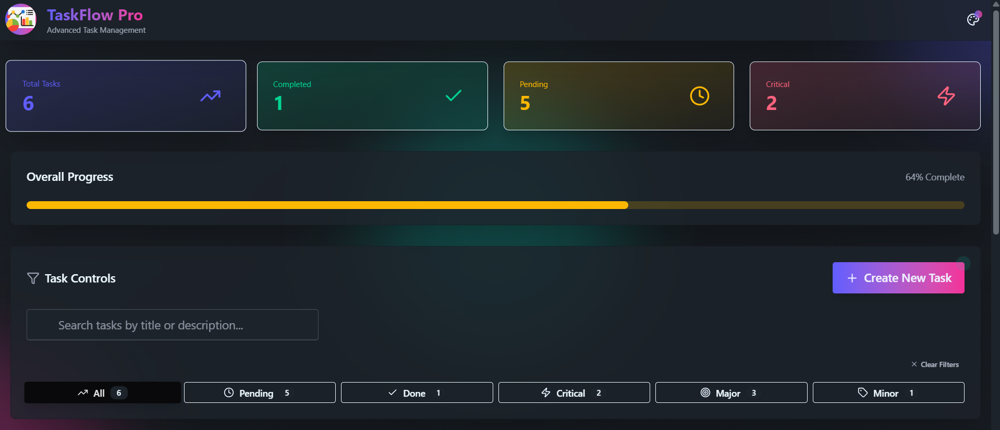
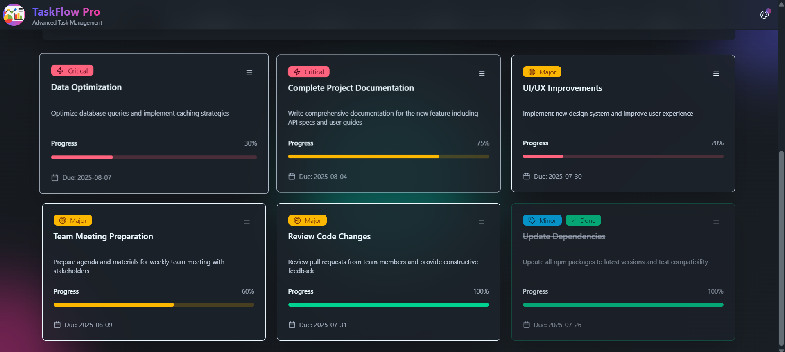
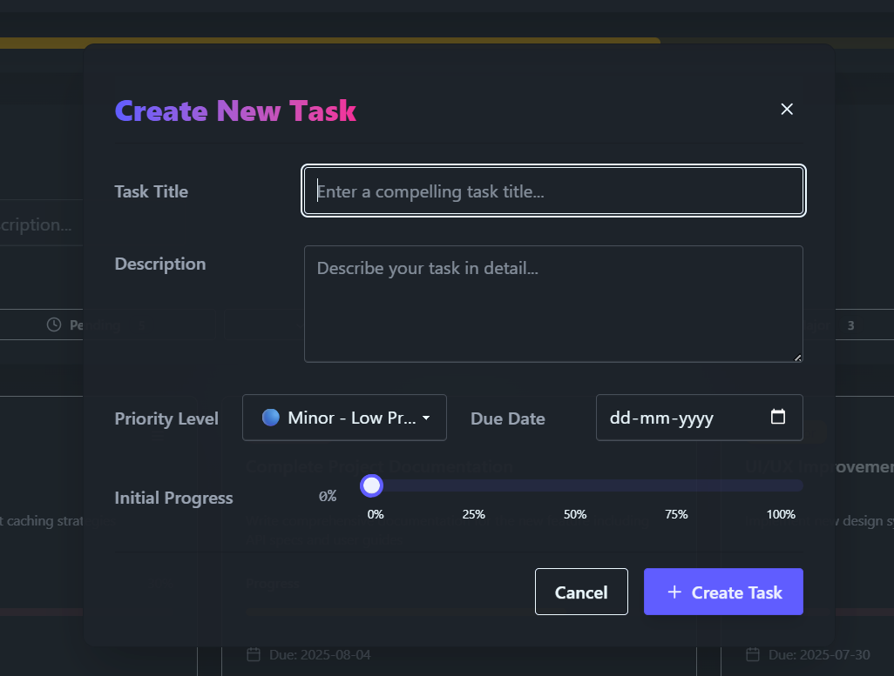
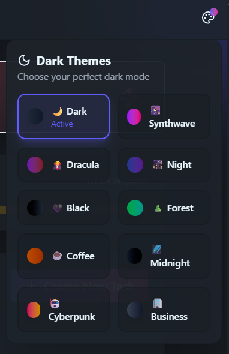

# TaskFlow Pro - Advanced Task Management React App

## Overview

**TaskFlow Pro** is a sleek and advanced React-based task management application that empowers users to organize, prioritize, and track tasks efficiently. Built with React functional components, Tailwind CSS v4, and DaisyUI, the app combines elegant design with practical functionality. It also supports theme switching, mobile responsiveness, and persistent storage — making it ideal for both productivity enthusiasts and developers.

---

## Tech Stack

- **React (Functional Components)**
- **Tailwind CSS v4 + DaisyUI**
- **Lucide React Icons**
- **LocalStorage API for persistence**
- **Responsive Design with Flexbox & Grid**

---

## Features

- **🌗 Dynamic Dark-Themed UI**  
  Choose from a variety of beautiful dark themes such as Synthwave, Cyberpunk, Dracula, Forest, and more for a personalized workspace.

- **📝 Task Management**  
  Add, edit, mark complete, or delete tasks. Each task includes:

  - Title & description
  - Priority (Critical, Major, Minor)
  - Due date
  - Progress tracking

- **🔍 Advanced Filtering & Search**  
  Instantly filter tasks by:

  - Completion status (All / Completed / Pending)
  - Priority level
  - Keyword in title or description

- **💾 Persistent Storage with LocalStorage**  
  No login required — all tasks, filters, and theme preferences are saved locally and persist across sessions.

- **📱 Responsive & Accessible Design**  
  Optimized for all devices: mobile, tablet, and desktop. Designed with accessibility and intuitive UX in mind.

- **🎨 Live Theme Switching**  
  Easily switch between elegant DaisyUI themes with smooth visual transitions and gradient previews.

- **📂 Organized Codebase**  
  Built with modular components, custom hooks, and proper state management using `useState` and `useEffect`.

---

## Screenshots

### 🔹 Main Dashboard

### 🔹 Task List & Controls

### 🔹 Task Form (Create / Edit)

### 🔹 Theme & Category Selection

---

## Usage

- **➕ Add Task:**  
  Click on the **Add Task** button to open the creation form. Fill in task details and submit.

- **✏️ Edit / 🗑 Delete Task:**  
  Use the three-dot menu on each task card to modify or remove tasks.

- **✅ Mark as Complete:**  
  Toggle completion from the same dropdown menu. Completed tasks are grayed out or styled differently.

- **🎯 Filter by Status or Priority:**  
  Use filter chips or buttons to view tasks that are Completed, Pending, or based on priority level.

- **🔎 Dynamic Search:**  
  Type into the search bar to filter matching tasks by title or description.

- **🎨 Theme Switcher:**  
  Click on the palette icon in the top bar to change the app’s theme in real-time.

---
