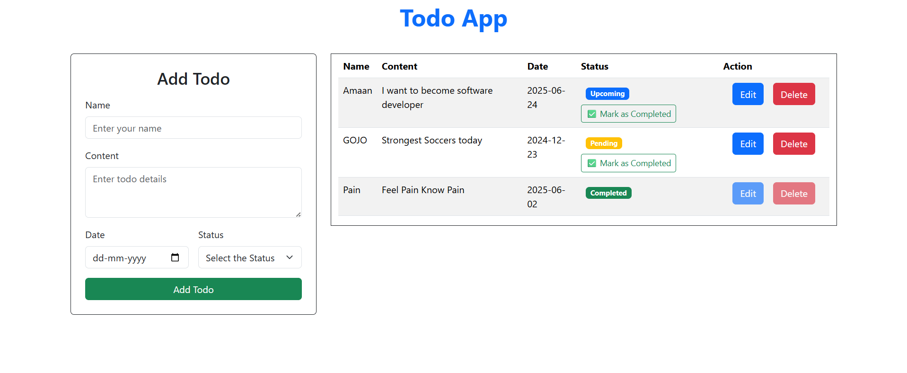

# 📝 Simple React Todo App

A clean and functional Todo application built using **React** and **Bootstrap**. This app allows users to add, edit, delete, and mark tasks as completed. Once a task is completed, it cannot be edited or deleted.

---

## 🚀 Features

- ✅ Add new todos
- 📝 Edit existing todos (only if not completed)
- ❌ Delete todos (only if not completed)
- ☑️ Mark todos as **Completed**
- 🧠 Dynamic status badge (Pending / Upcoming / Completed)
- 🔒 Completed todos are locked from modification

---

## 🖼️ Screenshot

---

## 🛠️ Tech Stack

- **React**
- **Bootstrap 5**
- **JavaScript (ES6+)**
- **HTML5 + CSS3**

---
