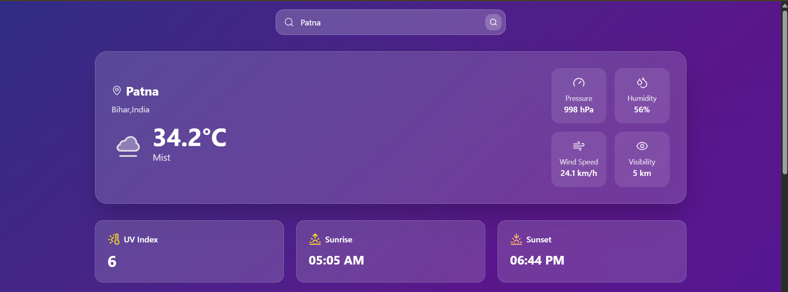
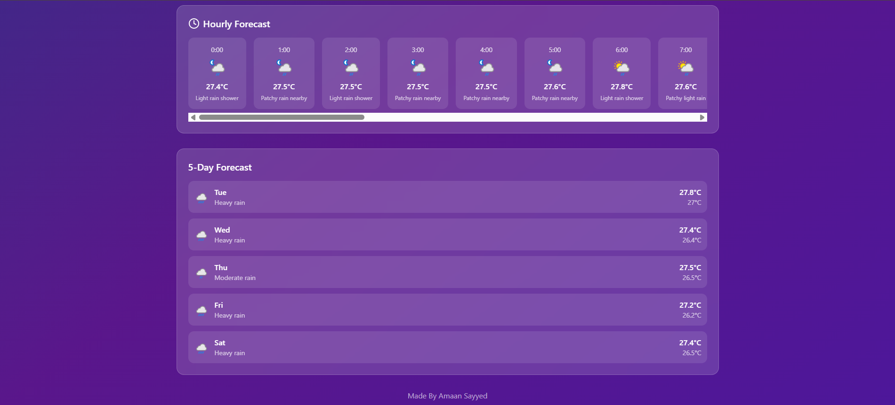

# 🌤️ Weather App

A clean and responsive weather forecast application built using **React**, **Tailwind CSS**, and **Axios**. Search for any city to get current weather conditions, detailed stats, and upcoming hourly forecasts.

---

## ⚙️ Features

- 🔍 Search weather by city name
- 🌍 Shows city, region, temperature, time, and weather condition
- 💧 Displays humidity, pressure, visibility, wind speed
- ⏰ Shows upcoming hourly forecast & 5 days forecast
- 📱 Fully responsive layout using **Tailwind CSS**
- ⚡ Fetches real-time data from [WeatherAPI](https://www.weatherapi.com/)

---

## 🚀 Technologies Used

- [React](https://reactjs.org/)
- [Tailwind CSS](https://tailwindcss.com/)
- [Axios](https://axios-http.com/)
- [WeatherAPI](https://www.weatherapi.com/)

---
